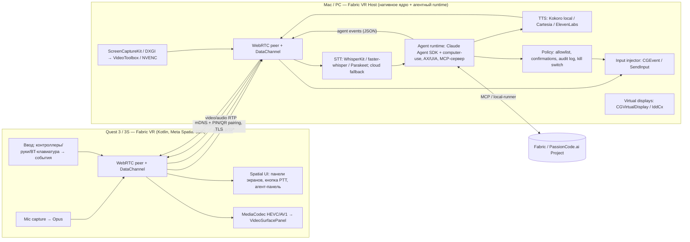

# Fabric VR — исследование и архитектурное описание

**Дата:** 2026-09-19 · **Статус:** ресерч-отчёт до начала разработки (репозиторий кода ещё не
содержит) · **Владелец:** оператор PassionCode.ai / Fabric

> Fabric VR — нативное Android-приложение для Meta Quest 3 / 3S: виртуальный рабочий стол
> (стриминг экрана Mac / Windows PC в mixed reality) **плюс AI Voice Assistant** — агент,
> запущенный на компьютере пользователя с полным контролем над ним, которому говорят голосом
> из VR и видят его действия на стриме. Первая функция — кнопка **Speech-to-Text**: диктовка в
> любое поле ввода на компьютере.

Каждый факт ниже опирается на один из четырёх source-брифов веб-ресерча
(`sources/01…04`) или на локальные измерения (`local-evidence-2026-09-19.md`). Что не удалось
подтвердить — помечено «не подтверждено» и собрано в разделе 9.

---

## 1. Резюме (TL;DR)

1. **Рынок сдвинулся под нами за последний год.** Meta встроила в Horizon OS 2.7 (август
   2026) бесплатный **Meta Virtual Display**: до 3 виртуальных экранов, паритет Mac/Windows,
   Input Forwarding. Microsoft выпустила бесплатный **Mixed Reality Link** (GA 2025-10-30).
   Virtual Desktop ($24.99) и Immersed — платные ветераны. **Ни у одного из них нет
   ИИ-агента, действующего на подключённом компьютере** — Meta AI на Quest управляет только
   самой гарнитурой. Это и есть наша дифференциация; конкурировать «ещё одним стримером» —
   нет смысла.
2. **Нативный путь на Quest — Meta Spatial SDK (Kotlin, Android Studio, Compose)**, актуальная
   версия v0.14.0 (2026-09-11). Он даёт Panels, passthrough, hand tracking, hot reload и
   специальную `VideoSurfacePanelRegistration` для видеоповерхности. Старый VrApi мёртв с
   2022 года; сырой OpenXR/NDK — только если Spatial SDK упрётся в лимиты.
3. **Стек стриминга — тот же, что у Meta.** Вскрытие установленного здесь
   `Meta Quest Virtual Display.app` показало: WebRTC (SRTP/DTLS/datachannel) + QUIC,
   ScreenCaptureKit + VideoToolbox, H.264/AV1, Opus, Bonjour, распространение вне
   App Store. Мы повторяем это открытыми компонентами: **libwebrtc (или Pion/str0m) с
   отключённым GCC**, ScreenCaptureKit → VideoToolbox HEVC/AV1 на Mac, DXGI + NVENC/AMF/QSV
   на Windows, MediaCodec-декод на Quest 3 (XR2 Gen 2 аппаратно декодирует HEVC и AV1).
4. **Голос и агент живут на хосте, а не на гарнитуре.** На Horizon OS нет Google Play
   Services → `SpeechRecognizer` не работает, встроенная диктовка Quest — только US-English.
   Микрофон Quest уходит как PCM/Opus по тому же WebRTC-линку, STT крутится на компьютере
   (WhisperKit на Apple Silicon / faster-whisper, Parakeet; облако Deepgram/AssemblyAI как
   fallback), а текст вводится через Accessibility API / `CGEvent` / `SendInput`.
5. **Агент — Claude Agent SDK с computer-use инструментом** (Opus 5 для контроля, Haiku 4.5
   для разбора намерений), гибридное восприятие «accessibility tree сначала, скриншот+zoom
   потом», слой безопасности (allowlist, подтверждение необратимых действий, kill switch в
   VR). Агент оформляется как **Fabric Provider** по `fabric-agent-contract` (MCP-профиль +
   local-runner), т. е. Fabric VR — ещё одна поверхность PassionCode.ai, а не отдельный
   продукт с собственным агентом.
6. **Порядок сборки:** Mac-first (тестовая пара Mac + Quest 3 уже подключена), LAN-only,
   один экран → кнопка Speech-to-Text → голосовой агент → виртуальные мониторы → Windows →
   удалённый доступ. Каждая фаза — через `/ux` (сценарии) и `/task-pipeline`.

---

## 2. Контекст продукта

### 2.1 Место в экосистеме Fabric / PassionCode.ai

Fabric — ядро PassionCode.ai, «agent-agnostic operating system for AI-native teams» (Electron
44 + React 19, pnpm, Supabase). Его принцип: агенты заменяемы и подключаются по контракту
(`fabric-agent-contract` 0.1.0: MCP `2026-07-28`, A2A `1.0`, `fabric-local-runner/0.1`),
а Project — долговременная единица работы. Для Fabric VR это означает:

- **хост-агент Fabric VR = Fabric Provider.** Его capabilities (`desktop.control`,
  `desktop.dictate`, `desktop.observe`) декларируются MCP-профилем, а сам агентный цикл может
  быть local-runner вида `claude-code` — ровно та форма, которую контракт уже описывает;
- **VR-клиент — поверхность исполнения** (execution surface), как чат или Electron-окно;
  purpose и history остаются в Project, не в гарнитуре (принцип 1 vision.md);
- бренд-нейминг «Fabric VR» логичен внутри семьи, но **снаружи коллизия с Microsoft Fabric**
  (data/AI платформа) доминирует в поиске; «Fabric Engine» (VR/VFX-тулинг) закрыт в 2017 —
  нужен формальный trademark-поиск до публикации в Store (бриф 01 §6).

### 2.2 Конкурентный ландшафт (бриф 01)

| Продукт | Цена | Платформы | Экраны | Стек / доступ | ИИ |
|---|---|---|---|---|---|
| **Meta Virtual Display** (встроен в Horizon OS, ex-Remote Desktop) | бесплатно | Windows + Mac (паритет с 2026-08) | до 3, 720p/1080p/1440p | WebRTC+QUIC, Input Forwarding | нет |
| **Mixed Reality Link** (Microsoft) | бесплатно | Windows 11 22H2+ | до 3 | порты 8264/8265 TCP, 8266 UDP; 5/6 GHz | нет |
| **Virtual Desktop** | $24.99 | Win 10/11; Mac-стример переписан в 2025 | до 3 виртуальных на Mac | H.264/HEVC/AV1 до 200–500 Mbps, VDXR, SSW | нет |
| **Immersed** | Free / $5.99+ / $14.99 мес | Win/Mac + Quest/Vision Pro | 3 (free) / 5 (Pro) | облачные комнаты | «Curator AI» только с невышедшим Visor |
| **Apple Vision Pro Mac Virtual Display** | в составе устройства | Mac | **1**, до 5120×2880, фовеация | прямой линк вне Wi-Fi; с visionOS 26.4 публичный Foveated Streaming на NVIDIA CloudXR | нет |
| Bigscreen / Fluid / Xreal Nebula / Viture SpaceWalker | бесплатно | разные | — | социальные / 3DoF | нет |

**Боли пользователей** (2025–2026): латентность 30–150 мс с пиками до 400 мс из-за роутера;
слабый Mac (Meta закрыла это только в августе 2026); настройка сети ложится на пользователя;
у Vision Pro один экран; ввод текста руками в воздухе — мучение.

**Прямой прецедент нашей идеи:** Simular «Sai» ($50–500+/мес) прототипирует голосовое
управление computer-use агентом с очков Meta Ray-Ban с прерыванием на ходу — но без
VR-дисплея. В VR такого нет ни у кого.

**Рынок**: сигналы противоречивы — IDC-источники дают −42 % YoY по MR/VR в 2025, другой
источник — 2,3 млн Quest за 2025 и 8,5 млн MAU (оба не сведены). Meta Horizon+ прошёл
1 млн подписчиков; Quest for Business закрывается с 2026-02-20; Workrooms закрыт
2026-02-16. Вывод: ниша — prosumer / solo knowledge worker, а не enterprise-развёртывания.

---

## 3. Платформа Meta Quest: что можно и что нельзя (бриф 02 + local evidence)

### 3.1 Устройство

Quest 3: Snapdragon XR2 Gen 2, 2064×2208 px/глаз, 72/90/120 Hz, Wi-Fi 6E (широко цитируется,
первичный spec-лист не подтверждён), USB-C. Quest 3S: тот же SoC, 1832×1920 px/глаз, Fresnel.
Аппаратный декод **HEVC и AV1** (Meta явно говорит, что AV1 не аппаратный только на
Quest 2/Pro). Рабочие потолки по опыту стримеров: HEVC 10-bit ~150 Mbps, AV1 120–200 Mbps.
Bluetooth-клавиатура/мышь — стандартный Android HID; tracked keyboard — с v72+.

На машине разработки: Quest 3 (`eureka`) виден по wireless adb `192.168.0.253:5555`, во время
ресерча ушёл в offline — `getprop` нужно снять при живой гарнитуре. Android Studio 2026.1,
SDK 35/36.1, NDK 27.2 уже установлены.

### 3.2 Horizon OS и Store

- Нумерация сменилась: v85 (январь 2026) → **Horizon OS 2.x** (с недели 2026-02-23), сейчас
  **2.7** (август 2026). В хелпах Meta ещё встречается «v81+» — старая шкала.
- Публиковать можно и immersive-приложения, и **2D Android-приложения** (panel apps).
- **VRC:** ≥60 fps, интерактивные — 72/80/90/96/100/120 Hz; микрофон — видимое пользователю
  разрешение + privacy policy; подавать на ревью **за ≥2 недели** до релиза. App Lab слит в
  Store (2024-08).
- **Нет Google Play Services** → нет Play Billing, FCM, Google-речи. IAP/подписки — через
  Meta Platform SDK (детали API в этом проходе не сняты — не подтверждено).
- Сторонние гарнитуры на Horizon OS (ASUS, Lenovo) — программа **приостановлена 2025-12-17**.
  Целимся только в Quest 3/3S.

### 3.3 Нативные пути разработки

| Путь | Что даёт | Вердикт |
|---|---|---|
| **Meta Spatial SDK** (Kotlin, Compose, Android Studio) v0.14.0 | Panels (Activity/View/Compose в 3D), `VideoSurfacePanelRegistration` (обход View-системы, макс. производительность, DRM), passthrough, MRUK, руки, контроллеры, spatial audio, hot reload, Spatial Editor | **Основной.** Соответствует требованию нативного Android-приложения |
| OpenXR + Meta OpenXR Mobile SDK (C/C++, NDK) | Composition layers, `XR_FB_passthrough`, refresh rate | Резерв, если Spatial SDK не даст нужной резкости панели или частоты кадров |
| VrApi / Oculus Mobile SDK | — | **Мёртв с 2022-08-31** |
| Unity / Unreal | — | Не нативно; исключено по постановке |

Ограничение, которое надо помнить: панель «не превышать 2064×2208 px из-за памяти»;
для стрима использовать `PixelDisplayOptions` (1:1 пиксели). Лимит числа панелей/слоёв в доках
не найден — измерять на устройстве.

### 3.4 Голос на гарнитуре

- Meta Voice SDK / Wit.ai **живы** (доки обновлялись 2026-02/04), deprecation не найден.
- Android `SpeechRecognizer` — **не работает** (нет recognition service); встроенная диктовка
  Quest — только US-English. Для русского + английского это закрывает on-headset STT.
- Meta анонсировала «Muse Voice Transcribe» (2026-09-01) — позиционирование для Quest-разработки
  не подтверждено.

**Решение:** микрофон захватываем на Quest, а распознаём **на хосте** (см. §5.4).

---

## 4. Как устроен стриминг у лидеров (бриф 04 + вскрытие Meta-приложения)

### 4.1 Официальный стек Meta (измерено локально)

`Meta Quest Virtual Display.app` v106 (`com.meta.virtualdesktop`, кодовое имя **Highwind**):

| Слой | Что нашли |
|---|---|
| Транспорт | WebRTC: `UDP/TLS/RTP/SAVPF`, SRTP/DTLS, `webrtc-datachannel`, transport-wide CC, BWE; **плюс QUIC-клиент** (transport params, resumption cache) |
| Захват / кодек | `ScreenCaptureKit`, `VideoToolbox`, `CoreDisplay` (виртуальные дисплеи), H.264 и **AV1** (`_av1Decode`), Metal |
| Аудио | `libopus_mlow.dylib` — Opus «MLow» Meta; AGC2 WebRTC |
| Обнаружение / пейринг | Bonjour `_highwind_sp_v1._tcp.`, подпись сертификатов через GraphQL (`HighwindCertificateSigning`) — привязка к аккаунту Meta |
| Оболочка | React Native / Hermes поверх нативного RTC-ядра; Sparkle-автообновление → **вне Mac App Store**; LoginItem-лаунчер; `FileProvider.appex` для буфера/файлов |
| Windows | ссылка на лицензию `WindowsAppForQuest` → Mixed Reality Link — это Microsoft «Windows App» |

Вывод: ничего закрытого, что нельзя воспроизвести; но их пейринг завязан на аккаунт Meta и их
бэкенд, чего у нас не будет — нам нужен LAN-пейринг по PIN/QR и опциональный relay.

### 4.2 Open-source ориентиры

- **Sunshine/Moonlight/Apollo**: захват DXGI DDA + WGC (Windows), ScreenCaptureKit (macOS);
  энкодеры NVENC/QSV/AMF/VideoToolbox; свой UDP с FEC; 60–80 Mbps база, потолок 500;
  Apollo даёт каждому клиенту виртуальный дисплей. **GPLv3-семейство** — копировать код в
  закрытый продукт нельзя, можно учиться и/или изолировать процессом.
- **ALVR**: TCP-контроль + UDP-стрим, UDP-broadcast discovery на 9943, сервер авторизует
  клиента; MediaCodec-декод; восстановление через IDR; латентность сильно зависит от GPU
  (10–25 мс encode на Radeon vs 40–100 мс на RTX 4090 в старых issue).
- **Apple Foveated Streaming (visionOS 26.4, на NVIDIA CloudXR)** — публичный API у Apple;
  показывает направление (фовеация по взгляду), но на Quest 3 eye-tracking нет.

### 4.3 Хостовые API

| Задача | macOS | Windows |
|---|---|---|
| Захват экрана + системного звука | `ScreenCaptureKit` (`SCStream`, per-display, кадровая частота, аудио) | DXGI Desktop Duplication (лучше при энкоде на том же GPU) / `Windows.Graphics.Capture` |
| Аппаратный энкод | `VideoToolbox` HEVC/H.264 low-latency (WWDC21 10158), AV1 — по устройству | NVENC / AMF / Intel QSV (Media Foundation или vendor SDK) |
| Виртуальный монитор | **нет публичного API** — приватный `CGVirtualDisplay` (так делают BetterDisplay, DeskPad, Immersed, Virtual Desktop) → только notarized-дистрибуция вне App Store | **IddCx** indirect display driver (Parsec VDD, `VirtualDrivers/Virtual-Display-Driver`), подпись через SignPath/attestation; 24H2 ARM64 — нюансы |
| Инъекция ввода | `CGEvent` (мышь, клавиатура, `CGEventKeyboardSetUnicodeString` для Unicode); TCC: Accessibility, Input Monitoring, Screen Recording; **Secure Input** блокирует синтетику в полях паролей | `SendInput` (`KEYEVENTF_UNICODE`, `wVk=0`); **UIPI** не пускает в elevated-окна |
| Чтение UI-дерева (для агента) | `AXUIElement` | UI Automation |

### 4.4 Транспорт и задержки

- WebRTC-GCC изначально настроен на ~2,5 Mbps телефонии → для 100–500 Mbps в LAN его нужно
  **переопределять** (фиксированный/ступенчатый битрейт по RTT и потерям). На LAN основная
  латентность — захват+энкод, не сеть.
- Замеры рынка: Air Link / Virtual Desktop 65–85 мс e2e; декод — крупнейший компонент (~12 мс,
  HEVC 200 Mbps +8 мс к H.264). Цель для нас: **<50 мс glass-to-glass на LAN 6 GHz**,
  измеряется собственной телеметрией (см. §5.7).
- Android low-latency decode (`KEY_LOW_LATENCY`) — не стандарт между устройствами; на Quest
  проверяем экспериментально.
- USB-C tether (USB 3.0, ~5 Gbps) — резервный режим «кабель» с лучшим битрейтом.
- Рекомендация пользователю (и авто-диагностика в приложении): отдельный 6 GHz SSID.

---

## 5. Архитектура Fabric VR

### 5.1 Компоненты



**Три канала на одном WebRTC-соединении:**

| Канал | Направление | Содержимое | Требование |
|---|---|---|---|
| `video` (RTP) | Host → Quest | HEVC/AV1, 1 поток на экран, 60–90 fps, 100–200 Mbps | минимум задержки, без B-кадров, IDR по запросу |
| `audio` (RTP, Opus) | оба | системный звук хоста → Quest; микрофон Quest → хост; TTS-ответы агента → Quest | 20 мс кадры, VAD-метаданные |
| `control` (DataChannel, reliable + unreliable) | оба | мышь/клавиатура/скролл, буфер обмена, PTT-события, конфиг стрима, `agent.*` события (transcript, plan, step, confirm-request, done, error), телеметрия | protobuf/CBOR-схема с версией |

### 5.2 Quest-клиент (нативный Android)

- **Стек:** Kotlin, Meta Spatial SDK v0.14+, Jetpack Compose для 2D-панелей управления,
  `VideoSurfacePanelRegistration` для экранов (Surface напрямую из `MediaCodec`), passthrough
  по умолчанию (MR-режим), MRUK для привязки экранов к столу/стене, hand tracking + контроллеры.
- **Панели экранов:** одна панель на стрим, `PixelDisplayOptions` 1:1, размер/кривизна/позиция
  сохраняются per-host; пресеты Portrait/Compact/Wide/Ultrawide как у Meta, но с точным
  соответствием пикселей источника.
- **Ввод:** луч/щипок → `mouse.move/click/scroll`; BT-клавиатура → `key` события; виртуальная
  клавиатура Quest — fallback. Все события идут на хост, никакой локальной интерпретации.
- **Кнопка PTT (Speech-to-Text):** плавающая кнопка у панели + кнопка контроллера (например,
  удержание Grip) + жест. Удержание = запись, отпускание = финал. Индикатор уровня, живой
  транскрипт на панели, отмена жестом.
- **Агент-панель:** лента событий агента (что услышал, план, текущий шаг, запрос подтверждения
  Да/Нет, результат), большая кнопка **STOP** (kill switch), переключатель «наблюдать /
  управлять».
- **Декод:** `MediaCodec` HEVC (основной, 10-bit при поддержке) / AV1 (эксперимент),
  `KEY_LOW_LATENCY`, вывод в Surface панели без копирований; при потерях — запрос IDR.
- **Сеть:** libwebrtc Android (или своя обёртка над Pion через gomobile — решение на этапе
  spike), mDNS-обнаружение хостов, PIN/QR пейринг, хранение доверенных хостов в EncryptedSharedPreferences.
- **Разрешения:** `RECORD_AUDIO`, сеть; privacy policy для Store; VRC 72 Hz+ на UI.

### 5.3 Хост-приложение (Mac first, потом Windows)

Два процесса, одна установка:

1. **Streaming core** — нативный (Swift на macOS; на Windows C++/Rust): захват, энкод, WebRTC,
   инъекция ввода, виртуальные дисплеи, mDNS, пейринг, локальный gRPC/Unix-socket API для
   агента. Отдельный процесс, чтобы падение агента не рвало стрим и чтобы Accessibility/Screen
   Recording TCC-гранты были у одного стабильного бинаря.
2. **Agent runtime** — Node/TypeScript или Python процесс на **Claude Agent SDK**; владеет
   голосовым пайплайном, computer-use циклом, политикой и MCP-сервером. Может перезапускаться
   независимо.

Распространение macOS: **notarized DMG вне App Store** (приватный `CGVirtualDisplay`,
инъекция ввода, TCC) + Sparkle-автообновление — как у Meta. Windows: MSIX/инсталлятор +
подписанный IddCx-драйвер (только с фазы «виртуальные мониторы на Windows»).

### 5.4 Голосовой пайплайн

```
Quest mic ──Opus──▶ Host: jitter buffer ─▶ Silero VAD ─▶ STT (streaming, partials)
                                                          │
                       PTT-режим: partial-текст ◀─────────┤ финал → Haiku 4.5 «clean-up»
                       (на панель Quest)                  │      (пунктуация, команды-правки,
                                                          │       язык RU/EN авто)
                                                          ▼
                                          Dictate: Accessibility API вставка в focused
                                          element → fallback: буфер + Cmd/Ctrl+V →
                                          fallback: посимвольно CGEvent/SendInput Unicode
```

- **STT на хосте:** Apple Silicon — WhisperKit (CoreML, <200 мс, RU/EN) или Apple
  `SpeechAnalyzer` (on-device, macOS 26); универсально — faster-whisper / Parakeet-TDT
  (6 % WER EN) на GPU. **Cloud fallback** по флагу: Deepgram Nova-3 / AssemblyAI streaming
  ($0.15–0.45/ч) для шумного аудио или слабого CPU; переключение явное, с индикатором
  «облако» на панели (приватность).
- **Режим PTT — без wake word** (без ложных срабатываний); hands-free через Porcupine —
  позже, по сценариям.
- **Вставка текста:** три ступени, каждая с проверкой результата (чтение значения элемента
  после вставки). Secure Input на macOS (поля паролей) — честно сообщаем «поле защищено».
- **TTS обратной связи агента:** Kokoro-82M локально (sub-300 мс, бесплатно) по умолчанию,
  Cartesia Sonic / ElevenLabs Flash — платная опция качества; аудио уходит по тому же
  audio-каналу с приоритетом над системным звуком (ducking).
- **Barge-in:** пользователь говорит/нажимает STOP → TTS обрывается, текущий шаг агента
  отменяется (cancel token), состояние сохраняется. Оркестрация — Pipecat или LiveKit Agents
  (оба cascaded, оба с прерыванием, оба зовут Anthropic); выбор — на spike.

### 5.5 AI-агент (полный контроль компьютера)

- **Runtime:** Claude Agent SDK; модель контроля — **Claude Opus 5** (`claude-opus-5`,
  $5/$25 за MTok, 1M контекст), fallback **Sonnet 5** (`claude-sonnet-5`, $3/$15); разбор
  намерений и чистка диктовки — **Haiku 4.5**. Инструмент computer use — актуальная версия
  по докам платформы на момент сборки (веб-доки 2026-09-19 называют
  `computer_toolset_20260801`; локальная копия skill-справочника ещё `computer_20251124` —
  сверить при реализации). Adaptive thinking, streaming.
- **Восприятие — гибрид:** сначала `AXUIElement` / UI Automation (точные координаты, роли,
  значения полей — дёшево по токенам), затем скриншот XGA 1024×768 с масштабированием координат
  (Retina 2×!) и `zoom` на регион. Скриншоты берём из **того же ScreenCaptureKit-потока**, что
  и стрим — без второго захвата.
- **Инструменты агента (MCP-сервер `fabric-vr-host`):** `screen.capture`, `ui.tree`,
  `input.mouse/keyboard`, `text.insert`, `app.launch/focus`, `clipboard`, `shell.run`
  (с allowlist), `files.*`, плюс встроенные Read/Edit/Bash SDK по политике. Один и тот же
  MCP-сервер использует и агент, и Fabric-хост — контракт `fabric-agent-contract`.
- **Политика (обязательна, не опция):**
  - allowlist приложений/директорий по умолчанию + blocklist (банки, менеджеры паролей,
    системные настройки безопасности);
  - **подтверждение в VR** для необратимых действий (удаление, отправка, платежи, `rm`,
    `git push --force`), таймаут = отмена;
  - бюджет шагов/времени/долларов на задачу, детектор циклов;
  - экранное содержимое = недоверенный ввод (prompt injection): сканирование текста перед
    подачей в модель, запрет «инструкций со экрана»;
  - **kill switch**: STOP в VR и горячая клавиша на хосте останавливают инъекцию ввода на
    уровне streaming core (не зависит от агента);
  - **audit log** каждого действия (что, где, скриншот до/после) → Evidence в Fabric Project.
- **Обратная связь пользователю:** поток событий `agent.transcript → agent.plan → agent.step
  (с bbox на экране) → agent.confirm → agent.done`, озвучка ключевых шагов; курсор агента
  визуально отличается от курсора пользователя (оверлей в VR по bbox из событий).
- **Fallback-цепочка:** Opus 5 → Sonnet 5 → (при недоступности API) режим «только диктовка и
  ручное управление» с честным сообщением; контракт tool-calls неизменен между моделями.

### 5.6 Обнаружение, пейринг, безопасность канала

- mDNS `_fabricvr._tcp` (аналог `_highwind_sp_v1`), TXT: имя хоста, версия протокола, ОС,
  экраны.
- Пейринг: хост показывает 6-значный PIN / QR; SPAKE2-подобный обмен → взаимные
  самоподписанные сертификаты, пиннинг (DTLS fingerprint). Хранение: Keychain / DPAPI /
  EncryptedSharedPreferences. Без аккаунта и без нашего бэкенда для LAN.
- **Remote (фаза 6):** свой relay/TURN или Tailscale-интеграция; никогда UPnP-открытия без
  секрета (урок Virtual Desktop, 2025-06).
- Секреты API-ключей (Anthropic, cloud STT) — только на хосте, в Keychain; в VR никогда не
  уходят.

### 5.7 Наблюдаемость и качество стрима

- Телеметрия per-frame: capture→encode→send→recv→decode→present timestamps; отображение
  «latency HUD» в VR; агрегаты в локальный лог + опциональная отправка (Sentry — через
  `error-tracking` при обвязке).
- Адаптация: ступенчатый битрейт по RTT/потерям/`wifi_frequency` (5/6 GHz), пересылка IDR, FEC;
  режим «текст» (сохранение чёткости: IDR чаще, QP ниже, 10-bit) vs «видео».
- Авто-диагностика сети при первом запуске (канал Wi-Fi, RSSI, 2.4/5/6 GHz) с рекомендациями —
  превращаем главную боль рынка в фичу.

### 5.8 Соответствие фич технологиям

| Фича | Quest | Host | Агент/ИИ |
|---|---|---|---|
| Виртуальный десктоп (1 экран) | Spatial SDK panel + MediaCodec HEVC | ScreenCaptureKit/DXGI + VideoToolbox/NVENC + WebRTC | — |
| Ввод мышь/клавиатура из VR | контроллеры/руки/BT → control-канал | CGEvent / SendInput | — |
| **Speech-to-Text кнопка** | PTT UI, Opus mic uplink, живой транскрипт | VAD + WhisperKit/faster-whisper; вставка через AX/paste/Unicode | Haiku 4.5 очистка |
| **AI Voice Assistant** | агент-панель, STOP, подтверждения, оверлей шагов | MCP-сервер хоста, policy, audit | Claude Agent SDK + computer use (Opus 5), AX/UIA гибрид, TTS |
| Несколько виртуальных мониторов | N панелей, MRUK-раскладка | CGVirtualDisplay (Mac) / IddCx (Win), поток на дисплей | агент видит все экраны |
| Удалённый доступ | тот же клиент | relay/TURN или Tailscale | — |
| Fabric-интеграция | — | Provider manifest (MCP + local-runner) | Evidence/audit в Project |

---

## 6. Ключевые решения и компромиссы

| # | Решение | Альтернатива | Почему так |
|---|---|---|---|
| D1 | **Meta Spatial SDK** как основа Quest-клиента | OpenXR/NDK; Unity | Нативный Kotlin, активная поддержка (v0.14.0, 09/2026), готовая видеопанель; NDK — резерв при проблемах с резкостью/FPS |
| D2 | **WebRTC (libwebrtc или Pion/str0m) с кастомным контролем битрейта** | свой UDP+FEC (Moonlight-стиль) | Тот же выбор, что у Meta; готовые SRTP/DTLS/ICE/datachannel и путь в remote; цена — переопределить GCC и джиттер-буфер. Если spike покажет >60 мс, переходим на Option A (свой UDP) для видео, оставив WebRTC для control/audio |
| D3 | **HEVC 10-bit основной, AV1 экспериментальный** | H.264 | Оба аппаратны на XR2 Gen 2; HEVC стабильнее по отзывам, AV1 — на 30 % эффективнее, но были проблемы качества |
| D4 | **STT и агент на хосте** | STT на Quest / в облаке напрямую | Нет Google-речи на Horizon OS, диктовка Quest только EN-US, у хоста есть GPU/ANE, нет лишнего сетевого плеча, приватность |
| D5 | **Claude Agent SDK + computer use, гибрид AX/скриншот** | OpenAI CUA (preview, может быть снят за 2 недели), Agent S3 (OSS, свой grounding) | Готовый harness с permissions/hooks/MCP; лидерство Claude-моделей на OSWorld-Verified; контракт Fabric уже описывает `claude-code` local-runner |
| D6 | **Cascaded STT→LLM→TTS, не speech-to-speech** | OpenAI Realtime / Gemini Live | Агенту нужны надёжные tool calls; S2S-модели пока слабы в агентной оркестрации |
| D7 | **Mac first, notarized вне App Store** | Windows first; App Store | Тестовая пара — Mac + Quest 3; Mac — главная боль рынка; приватный `CGVirtualDisplay` и инъекция ввода несовместимы с App Store |
| D8 | **PTT вместо wake word** на старте | Porcupine / openWakeWord | Нет ложных срабатываний, проще UX и приватность; hands-free — по сценариям позже |
| D9 | **Не форкать Sunshine/ALVR в закрытый продукт** | форк | GPLv3-семейство; учимся на архитектуре, код пишем свой (или изолируем процессом при явном решении об открытости) |
| D10 | **LAN-пейринг PIN/QR без аккаунта** | аккаунт Meta/облако как у Meta | Нет бэкенда на старте, приватность; remote — отдельная фаза |

---

## 7. Дорожная карта (фазы, каждая — через `/ux` → `/task-pipeline`)

| Фаза | Результат | Критерий приёмки (измеримый) |
|---|---|---|
| **0. Spikes (1–2 нед.)** | (a) Spatial SDK panel с MediaCodec HEVC из тестового потока; (b) Mac: SCK→VideoToolbox→WebRTC→Quest, HUD задержки; (c) AX-вставка текста в 5 приложениях; (d) Claude Agent SDK computer-use «открой Safari и найди X» на Mac | e2e latency измерена; резкость текста 11 pt читаема на панели 1:1; вставка работает в ≥4/5 приложений |
| **1. Desktop MVP (Mac, 1 экран, LAN)** | пейринг PIN, стрим, мышь/клавиатура из VR, аудио хоста, автообновление | <50 мс glass-to-glass на 6 GHz; 90 fps панели; 30 мин без разрыва |
| **2. Speech-to-Text кнопка** (первая фича) | PTT на контроллере и UI, live-транскрипт, вставка в фокус, RU/EN | <1 с от отпускания до текста в поле; WER на своём наборе фраз ≤ облачного fallback + 2 п.п.; Secure Input сообщается честно |
| **3. AI Voice Assistant** | агент-панель, голосовые команды → действия, подтверждения, STOP, audit | 10 эталонных задач (открыть/найти/переслать/переименовать/…) — ≥8 успешных; kill switch останавливает ввод ≤200 мс; ни одного необратимого действия без подтверждения в тестах |
| **4. Мультимониторы + MRUK** | 2–3 виртуальных дисплея на Mac, привязка к столу | 3×1440p при <60 мс |
| **5. Windows host** | DXGI+NVENC/AMF, SendInput, IddCx | паритет фаз 1–3 |
| **6. Remote + Store** | relay/Tailscale, VRC-чеклист, privacy policy, подписки (Meta Platform SDK) | ревью Store пройден (подача ≥2 нед. до даты) |
| **7. Fabric Provider** | manifest по `fabric-agent-contract`, Evidence в Project | `pnpm run check` контракта зелёный на нашем manifest |

Фазы 2 и 3 — UX-критичны: до кода — `docs/ux/scenarios.md` через `/ux` (сценарии PTT,
подтверждений, STOP, деградаций «нет сети / нет ключа / Secure Input»). Тексты интерфейса —
через `/copy` после `/brand-init`.

---

## 8. Риски

| Риск | Вероятность / влияние | Митигация |
|---|---|---|
| Бесплатный Meta Virtual Display «достаточно хорош», стриминг сам по себе не продаётся | высокая / высокое | Продаём агента и диктовку, стрим — носитель; рассмотреть режим «поверх Meta Virtual Display» невозможен (закрытый), поэтому свой стрим обязателен, но ценность — в ИИ |
| Резкость текста на панели Spatial SDK хуже, чем у Meta (композитор) | средняя / высокое | Spike 0a; резерв — OpenXR quad layer с NDK |
| GCC/джиттер WebRTC добавит >20 мс | средняя / среднее | Spike 0b; переход на свой UDP для видео (Option A) |
| Приватный `CGVirtualDisplay` сломается в новой macOS | низкая-средняя / среднее | Фаза 4 — виртуальные дисплеи опциональны; следить за BetterDisplay/DeskPad |
| Ошибки агента с необратимыми последствиями, prompt injection с экрана | средняя / критическое | Policy-слой (§5.5), sandbox по умолчанию «наблюдать», подтверждения, audit; evals (`agent-evals`) до релиза |
| Стоимость Opus 5 на длинных задачах | средняя / среднее | Haiku для разбора, AX-дерево вместо скриншотов, бюджеты, Sonnet 5 fallback |
| Store: микрофон + «полный контроль ПК» вызовут вопросы ревью | средняя / среднее | Явная privacy policy, всё локально, ключи на хосте, ≥2 нед. запас |
| Trademark «Fabric» | средняя / среднее | Формальный поиск до Store; рабочее имя можно сменить |
| Спорные рыночные цифры (−42 % vs рост) | — | Не строить бизнес-кейс на объёме рынка; ниша prosumer + подписка Horizon+ как канал |

---

## 9. Не подтверждено / противоречиво (нужно снять при реализации)

- Точная строка computer-use инструмента (`computer_toolset_20260801` vs `computer_20251124`).
- Quest 3 Wi-Fi 6E vs 3S Wi-Fi 6 и поколение USB-C — нет первичного spec-листа.
- Лимит числа панелей/слоёв Spatial SDK, поддержка `KEY_LOW_LATENCY` в MediaCodec Quest.
- Используют ли Meta Virtual Display / Mixed Reality Link закрытые системные пути (у нас свой
  стек в любом случае).
- Позиционирование Meta «Muse Voice Transcribe» для Quest-разработки.
- Точные лицензии Sunshine/ALVR (не читали LICENSE) — важно только при заимствовании кода.
- Показатели OSWorld различаются по источникам в 2 раза — не использовать как маркетинг.
- Рыночные объёмы Quest 2025 — источники противоречат.
- Свойства подключённого Quest 3 (`getprop`) — гарнитура была offline.

---

## 10. Что использовано и источники

**Инструменты семьи/локальные:** `claude-api` (модели, цены, computer use — сверка локальной
копии с веб-доками), `agent-orchestrator` (структура цикла, fallback-цепочка, бюджеты, HITL),
`agent-interop` (MCP vs A2A, `fabric-agent-contract` профили), `evidence-docs` (каждый факт с
источником). Маршрут `/task-pipeline` не применялся — кода нет, отчёт исследовательский;
`/ux`, `/task-pipeline` — следующий шаг.

**Локальные измерения:** [`local-evidence-2026-09-19.md`](local-evidence-2026-09-19.md).
**Веб-брифы:** [01 конкуренты и рынок](sources/01-competitors-market.md) ·
[02 платформа Quest](sources/02-quest-platform.md) · [03 агент и голос](sources/03-agent-and-voice.md) ·
[04 стриминг](sources/04-streaming-tech.md).
