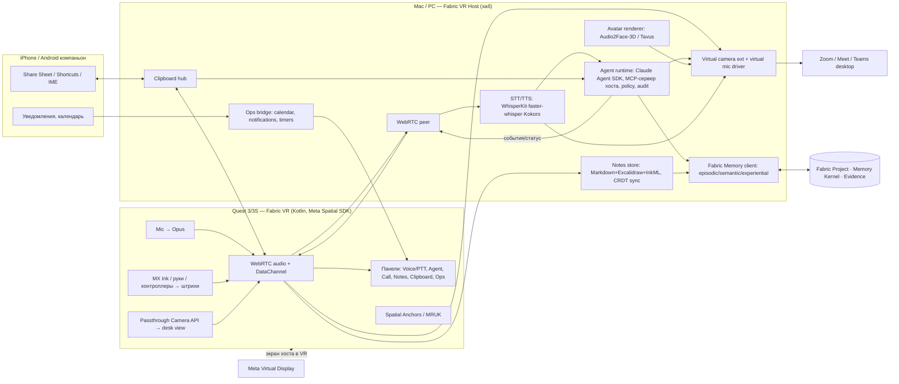

# Fabric VR — рабочий слой поверх Meta Virtual Display

**Дата:** 2026-09-19 (вторая итерация, после поворота скоупа) · **Статус:** ресерч и
продуктово-архитектурное описание, кода нет · **Предыдущий отчёт:**
[`2026-09-19-fabric-vr-research-report.md`](2026-09-19-fabric-vr-research-report.md) (стриминг
своего дисплея — снят с повестки, см. [`2026-09-19-scope-pivot.md`](2026-09-19-scope-pivot.md)).

> **Тезис.** Дисплей в Quest уже решён и бесплатен (Meta Virtual Display, Horizon OS 2.7).
> Не решено всё, что делает гарнитуру *рабочим местом*: голос как основной ввод, агент,
> которому можно поручить работу на компьютере и надзирать за ним голосом, звонки в
> Meet/Zoom/Teams с нормальным микрофоном и «лицом», заметки и наброски, единый буфер обмена
> между гарнитурой, компьютером и телефоном, уведомления и календарь. Fabric VR — этот слой.
> Его накапливающийся актив — **личный рабочий контекст** (словарь, стиль, люди, проекты,
> решения, исправления агента), лежащий в Fabric Memory Kernel, принадлежащий пользователю
> и экспортируемый. С каждым днём агент, диктовка и заметки становятся точнее — это и есть
> долгосрочная ценность.

Факты ниже опираются на брифы [`sources/01…09`](sources/) и локальные измерения
([`local-evidence-2026-09-19.md`](local-evidence-2026-09-19.md)); что не подтвердилось —
в разделе 10.

---

## 1. Резюме

1. **Дефицит рынка — не дисплей, а операции.** Из топ-15 ops-действий, которых не хватает
   работающим в Quest (бриф 06), Horizon OS закрывает полностью одно (восстановление сессий),
   частично семь, и **не закрывает семь**: буфер обмена между устройствами, голосовой надзор
   над агентом, питание, надёжные уведомления реального мира, календарь «что дальше»,
   щадящий глаза текст, быстрая диктовка-и-отправка. Meta AI на Quest («Hey Meta», v2.6)
   управляет только гарнитурой и позиционируется как репетиция для очков.
2. **Звонки.** У Quest 3 **нет камеры на лицо** — исходящее видео может быть только
   синтетическим (аудио-управляемый аватар), как Apple Persona, которую Zoom/Teams получают
   плоским видеокадром. Зато хост-сторона открыта: виртуальная камера (CoreMediaIO
   Camera Extension на Mac, DirectShow + Media Foundation на Windows) и виртуальный микрофон
   (BlackHole / VB-CABLE класса) с шумоподавлением — и звонок идёт в обычном десктопном
   Zoom/Meet/Teams, который пользователь уже видит через Virtual Display. Passthrough
   Camera API (GA 2025-04-30) даёт «показать стол/доску». Транскрипцию и перевод не строим —
   у Zoom/Teams/Meet они встроены; строим **память встреч** без бота (модель Granola).
3. **«Notion для VR» — пустая ниша.** Все VR-инструменты (ShapesXR, Figmin, Softspace,
   Horizon Dock) — только холст; все базы знаний (Notion, Obsidian) — только 2D-окно.
   Никто не совмещает пространственный захват (голос, текст, стилус Logitech MX Ink) с
   тегами/поиском/бэклинками. Формат хранения — Markdown + Excalidraw-JSON + InkML, CRDT-синк,
   каноника — папка, совместимая с Obsidian, push в Notion API.
4. **Буфер обмена.** Meta Virtual Display не даёт синхронизации буфера пользователю
   (help-страница — ни слова; в бинаре Mac-приложения plumbing есть, но фича не доставлена),
   запросы с 2020 по 2026. Ограничения платформ жёсткие: iOS — только через Share Sheet /
   Shortcuts, Android — только IME/foreground, Quest — AOSP-правила. Архитектура: хост — хаб,
   LAN mDNS+TLS, PAKE-relay вне сети, флаги конфиденциальности соблюдаются на захвате.
5. **Уроки аналогий.** Wispr Flow ($280M, оценка $2B) — личный словарь и стиль по приложениям;
   Granola/Fathom — память встреч; Ray-Ban Display — «быстрые ops» (субтитры, перевод,
   диктовка ответа) оказались хитами; **Meta купила Limitless (ex-Rewind) в декабре 2025**
   и сама строит «личную память» — но в очках, не на рабочем столе. Фреймворки сходятся:
   данные сами по себе не moat («storage unit»), moat — **структурированный контекст,
   встроенный в ежедневный цикл работы (system of engagement), при экспортируемой памяти**.
6. **Упаковка.** Рекомендация — «**агент, с которым разговариваешь**» как позиционирование
   (harness + контекст, растущие с каждым исправлением), **local-first / user-owned** как
   принцип доверия, память встреч и заметок — как питающие потоки, а не заголовок. Бесплатное
   Quest-приложение + одна подписка ($15–20/мес prosumer, $25–35 team), покупаемая на вебе
   и покрывающая хост-агента (модель Immersed); параллельно листинг с подпиской в Horizon
   Store (подписки и триалы поддерживаются; Horizon+ >1M подписчиков — Quest-владельцы платят
   регулярно). Anti-steering Store — проверить по текущим Terms.

---

## 2. Что говорит рынок (сводка брифов 05–09)

### 2.1 Дефицит операций в гарнитуре (бриф 06)

| # | Ops-действие | Боль | Horizon OS сегодня | Fabric VR |
|---|---|---|---|---|
| 1 | Буфер обмена гарнитура ↔ ПК ↔ телефон | нет copy/paste между VR и десктопом | нет (plumbing в Mac-приложении без фичи) | **модуль Clipboard** |
| 2 | Голосовой надзор над агентом (нарратив, подтверждение, прерывание) | нельзя следить за фоновым агентом, когда глаза заняты | нет | **модуль Agent** |
| 3 | Питание (1.5–2.5 ч, разряд под нагрузкой быстрее зарядки) | сессия обрывается | нет | режим низкого потребления, предупреждения, планирование звонков от батареи |
| 4 | Уведомления реального мира (звонки, SMS, календарь) | страх пропустить → снять гарнитуру | частично, ненадёжно | **модуль Ops** через телефон-компаньон |
| 5 | Видеть любую клавиатуру | gorilla arm, не видно клавиш | частично (v71 cutout) | опираемся на Meta + голос как замена клавиатуре |
| 6 | Больше 3 панелей | хотят 8–10 | частично (6) | не наше — Meta |
| 7 | Передача файлов без кабеля | шлют себе в WhatsApp | частично | Clipboard: ссылка + ленивая загрузка |
| 10 | Календарь / «следующая встреча» в гарнитуре | нет glanceable-расписания | нет | **Ops** |
| 12 | Субтитры/перевод при живом обращении коллеги | сбивает фокус | только очки | Voice Core: субтитры окружения (опция) |
| 15 | Быстро продиктовать и отправить | нужен отдельный flow | только очки | **Voice Core** |

Боли по часам работы: батарея, усталость глаз при чтении текста, вес, очки/линзы, ритуал
«надевания». Подтверждённые сценарии ранних пользователей: кодинг, письмо, работа в дороге
(Travel Mode). Данных о часах/неделю и готовности платить нет — закрывать своим опросом.

### 2.2 Звонки (бриф 05)

- Zoom на Quest — плоское 2D-приложение (июль 2025); Teams — только «Immersive» (1.6★);
  Meet — браузер без подтверждённого `getUserMedia`. Workrooms закрыт 2026-02-16,
  Quest for Business — с 2026-02-20 (полный закат 2030-01-04). **Immersed публично занимает
  этот вакуум** (PR 2026-02-12).
- Что видит собеседник сегодня: в WhatsApp/Messenger — мультяшный Meta Avatar с lip-sync по
  звуку. Meta Avatars SDK — End-of-Feature (v40.0.1 финальная); Codec Avatars / «Hologram
  Calling» — без SDK, Connect 2026-09-23/24 может что-то объявить.
- Проверенный паттерн — Apple: Persona синтезируется и отдаётся Zoom/Teams/Webex как
  **обычный плоский видеокадр**. Строительные блоки: Tavus (real-time conversational avatars,
  API), HeyGen, NVIDIA Audio2Face-3D (open source 2025-09-24, аудио → blendshapes); Zoom
  Meeting SDK официально поддерживает video avatars (форум 2026-03-24).
- Passthrough Camera API: Quest 3/3S, Horizon OS v74+, Camera2, 1280×1280@60, ~20–40 мс,
  разрешение `CAMERA` / `HEADSET_CAMERA`, обязательный индикатор записи → «вид на стол».
- Железо: открытые динамики слышны рядом — для звонков нужны проводные наушники (разъём на
  Quest 3; на 3S не подтверждён); Bluetooth-аудио с задержкой; батарея ~2 ч → зарядка между
  встречами.
- Meeting AI: бот-участник (Recall.ai от $0.50/ч) vs **локальный захват без бота** (Granola,
  $14/мес Business). Cluely/Final Round AI («шепни ответ») — детектируются, утечка 83k
  пользователей, 5–10 с задержки — **анти-пример позиционирования**. Krisp — жалобы на
  overage-ценообразование.

### 2.3 Заметки и наброски (бриф 09)

- Meta: whiteboard из Workrooms удалён ещё в 2024; Horizon Dock — плавающие заметки/задачи
  без поиска. VR-холсты: ShapesXR 4.1★, Figmin XR 4.3★ (персистентность, colocation),
  Softspace/Spaceframe 3.1★ (ближайший «Notion в VR», хрупкий). Kosmik (canvas-PKM на
  десктопе) закрывается 2026-07 — предупреждение об устойчивости «холст-PKM».
- **Logitech MX Ink** ($129.99, с 2024-09-25): 6DoF стилус, давление, haptics, 7 ч, стол или
  воздух, **OpenXR stylus interaction profile**, Horizon OS v69+. Hand tracking даёт ~1.7 см
  ошибки — для читаемого почерка стилус/контроллер. Surface Keyboard (v85, 2026-01-30).
- Распознавание: MyScript iink (enterprise от 100 лицензий × €12/год; iink 4.5 — infinite
  canvas), Google ML Kit Digital Ink (on-device, зависимость от Play Services на Horizon OS не
  проверена). Набросок → Mermaid через vision-LLM с самокоррекцией — рабочий паттерн 2026.
- Пространственная память: fMRI-данные (bioRxiv 2025) — надёжность представления комнаты
  предсказывает припоминание размещённых объектов; visionOS 26 виджеты на стенах — «game
  changer», но дрейф якорей на Quest признан Meta.

### 2.4 Буфер обмена (бриф 08)

Apple Universal Clipboard — BLE + P2P Wi-Fi, ~1–2 мин, хронически ненадёжен; Microsoft Cloud
Clipboard — 25 элементов / 4 MB, ломается обновлениями; KDE Connect — LAN, TLS, GPL; Intel
Unison закрыт 2026-01-01. iOS: чтение только в foreground, «Allow Paste» с iOS 16 → Share
Sheet / Shortcuts / клавиатура. Android 10+: foreground/IME; Android 16 сужает
accessibility-обход (`AccessibilityDataSensitive`). Флаги конфиденциальности:
`org.nspasteboard.ConcealedType`/`TransientType`, `EXTRA_IS_SENSITIVE`. Переиспользуемое OSS с
пермиссивной лицензией: LocalSend (Apache-2.0), magic-wormhole (MIT), Syncthing (MPL-2.0).

### 2.5 Аналогии и moat (бриф 07)

| Аналогия | Что накапливается | Урок |
|---|---|---|
| Gboard/SwiftKey → Wispr Flow ($15/мес, $2B) | личный словарь, стиль по приложениям | пользователи теряют «годы словаря» при смене — реальная стоимость переключения |
| Granola / Fathom / Otter ($8–20) | кросс-встречная память | компаундится, но лента переполнена; HIPAA/SOC 2 — планка |
| Rewind → Limitless → **Meta (2025-12-05)** | «всё, что вы видели и слышали» | Meta сама покупает тезис личной памяти; Recall/Screenpipe выжили на local-first |
| Ray-Ban Display (Neural Band) | быстрые ops: субтитры, перевод, диктовка ответа | ценность в *коротких* действиях без отрыва от дела |
| ChatGPT/Claude memory | переносимая память | lock-in на данных слабеет — держаться за привычку и глубину интеграции |

Фреймворки (a16z «Empty Promise of Data Moats», V7 2025, «memory is the moat» 2026,
System of Engagement 2026): актив должен быть **структурирован, оперативно использован в
ежедневном цикле и принадлежать пользователю**. Регуляторика: EU AI Act (общее применение
2026-08-02) запрещает вывод эмоций из голоса/лица на рабочем месте; голос как идентификатор —
биометрия по GDPR; ~11 штатов США требуют согласия всех сторон на запись; SOC 2 Type II —
норма.

---

## 3. Продукт: модули рабочего слоя

Fabric VR = тонкое Quest-приложение (панели поверх Virtual Display и passthrough) + хост-хаб
на Mac/PC + компаньоны на телефоне. Ниже — модули в порядке приоритета.

### M1. Voice Core (голос как основной ввод)

- PTT на контроллере/жесте/кнопке + опционально hands-free (wake word позже).
- Микрофон Quest → Opus → хост; **STT на хосте** (WhisperKit / faster-whisper / Parakeet,
  RU+EN; облачный fallback с индикатором), очистка Haiku 4.5.
- **Диктовка в любое поле** на компьютере: Accessibility API → paste → Unicode-ввод; Secure
  Input сообщается честно. Личный словарь и стиль по приложениям (урок Wispr) — пишутся в
  память.
- **Быстрые ops голосом**: «отправь коллеге, что опоздаю на 10 минут», «поставь таймер»,
  «что у меня дальше» — без открытия приложений (урок Ray-Ban Display).
- Субтитры окружения (опция): когда к вам обращаются вживую — распознанная речь панелью
  (микрофон гарнитуры), без вывода эмоций (EU AI Act).

### M2. Agent (агент на компьютере с голосовым надзором)

- Claude Agent SDK + computer use (Opus 5 / Sonnet 5), гибрид AX/UIA + скриншот+zoom,
  MCP-сервер хоста (`screen`, `ui.tree`, `input`, `text.insert`, `clipboard`, `files`,
  `shell` по allowlist, `calendar`, `messages`).
- **Режимы надзора** по модели Claude Cowork: Manual (подтверждать каждое действие), Auto
  (проверки безопасности, блок опасных), Skip — переключаются голосом; **нарратив статуса**
  каждые N шагов/секунд, **подтверждение перед необратимым**, **прерывание** словом/кнопкой
  STOP (kill switch в стрим-ядре хоста).
- **Dispatch**: задача агенту с телефона или из гарнитуры, исполнение на десктопе, отчёт
  голосом.
- Каждое исправление пользователя → experiential-запись в память (§5) → политика агента для
  *этой* машины и *этих* привычек.

### M3. Calls (звонки Meet / Zoom / Teams)

Звонок идёт в **десктопном клиенте на хосте**, который пользователь видит через Virtual
Display. Мы даём:

- **Виртуальный микрофон** хоста (Core Audio HAL / WASAPI virtual device) = микрофон Quest +
  шумоподавление (RNNoise/DeepFilterNet или Krisp SDK) — первая и самая ценная часть.
- **Виртуальная камера** хоста (CoreMediaIO Camera Extension; на Windows DirectShow **и**
  Media Foundation) с тремя источниками: (a) **аудио-управляемый аватар** (Audio2Face-3D →
  рендер стилизованного/фотореалистичного аватара; или Tavus API) — как Persona;
  (b) **вид на стол/доску** с Passthrough Camera API; (c) слайд «в гарнитуре, камера
  выключена» с именем. Приемлемость аватара в деловых звонках — **тестировать первым**.
- **Панель звонка в VR**: mute/camera/leave, участники, **субтитры платформы** (Zoom/Teams
  свои — не переизобретаем), заметки к встрече голосом.
- **Память встреч без бота**: локальный захват системного звука + микрофона (модель Granola),
  транскрипт → решения/действия/люди → память проекта; согласие участников — явное (закон о
  записи), запись выключаема, EU-режим без эмоций. **Никакого «шепни ответ»** — только
  подготовка до и итоги после (анти-пример Cluely).
- Проводные наушники рекомендуем в онбординге; расписание встреч сверяется с батареей.

### M4. Notes («Notion для VR»: голос, текст, наброски, схемы)

- **Захват**: голосовая заметка (STT + структурирование), текст (BT-клавиатура / Surface
  Keyboard / диктовка), **набросок** (MX Ink primary через OpenXR stylus profile; контроллер и
  руки — fallback), схема.
- **Распознавание**: почерк → текст (MyScript iink; ML Kit после проверки на Horizon OS);
  набросок → **Mermaid / Excalidraw / Figma** агентом (vision-LLM с самокоррекцией).
- **Организация как база знаний с первого дня**: теги, поиск, бэклинки, ежедневная страница,
  сущности (люди, проекты) — общие с памятью агента.
- **Хранение**: Markdown (текст), Excalidraw-JSON (схемы), InkML/точки (сырые штрихи для
  повторного распознавания), вложения аудио. **Каноника — папка, совместимая с
  Obsidian-vault**, у пользователя; CRDT (Automerge/Loro) для offline-first синка гарнитура ↔
  хост ↔ телефон; one-way push в Notion API.
- **Пространство**: заметки можно закрепить к столу/стене (Spatial Anchors/MRUK), но
  **плоский список всегда доступен** — дрейф якорей не должен терять заметки; рекомендуем 3–5
  стабильных «мест» (урок нейронауки: надёжность контекста, а не количество).
- **Агент над заметками**: транскрипция и извлечение действий, авто-связи, дайджест и
  resurfacing забытого — то, чего нет даже у лидеров second-brain.

### M5. Clipboard (единый буфер обмена)

- **Хост — хаб**; гарнитура и телефон — спицы. LAN: mDNS + TLS (пиннинг), вне LAN —
  PAKE-relay (magic-wormhole-стиль), E2E.
- Текст/ссылки — eager push; изображения/файлы — ссылка + ленивая загрузка.
- **Quest**: захват из панели/IME Fabric VR (AOSP-правила foreground). **iPhone**: Share
  Sheet extension + Shortcuts-автоматизация (фонового чтения нет — не обещаем). **Android**:
  компаньон-IME или accessibility-мост с учётом Android 16.
- Флаги `Concealed/Transient`, `EXTRA_IS_SENSITIVE` уважаются **на захвате**; автоистечение
  1–2 мин; история opt-in.
- Агент видит буфер через тот же фильтр — аудит и одинаковые правила.

### M6. Ops (мелкие операции, которые держат в гарнитуре)

- Уведомления телефона → панель в VR с триажем голосом (ответить/отложить/игнорировать);
  входящий звонок телефона.
- Календарь: «следующая встреча» всегда видна; за 2 мин — предложение открыть звонок (M3).
- Таймеры/фокус-сессии, «шаг в реальность» с сохранением состояния, индикатор батареи с
  прогнозом до конца встречи, передача файлов (через M5).

---

## 4. Архитектура

**Что мы НЕ строим:** стриминг экрана (Meta Virtual Display), клиент звонков (десктопные
Zoom/Meet/Teams), транскрипцию/перевод внутри звонка (встроены в платформы), свои аватары
на Meta Avatars SDK (EoF).

**Связь Quest ↔ хост**: один WebRTC-peer (аудио Opus в обе стороны + DataChannel для событий,
штрихов, буфера, кадров desk view как видеотрек), mDNS + PIN/QR пейринг, TLS-пиннинг —
тот же скелет, что в первом отчёте, минус видеострим десктопа.

**Хост**: два процесса — нативное ядро (Swift / C++: аудио-устройства, camera extension,
буфер, WebRTC) и агентный runtime (Claude Agent SDK, STT/TTS, память, заметки). Дистрибуция
macOS — notarized вне App Store (system extension для камеры и audio driver требуют
согласия пользователя; Camo доказывает App Store-путь, но нам нужны ещё AX и HAL).

**Fabric**: хост-агент = Fabric Provider (MCP-профиль + local-runner `claude-code`); каждая
диктовка, команда, встреча, заметка — Evidence/память в Project (§5). Quest — поверхность
исполнения; история живёт в Project, не в гарнитуре.

---

## 5. Накапливающийся актив: личный рабочий контекст

Контракт Fabric уже описывает Memory Kernel: append-only ledger, функции **working /
episodic / semantic / experiential**, scope run / agent / project / global, provenance и
evidence у каждой записи, derived-индексы перестраиваемы, «полный транскрипт — evidence, а не
память». Fabric VR — первый интенсивный источник для него.

| Поток (модуль) | Что извлекается | Как повышает ценность |
|---|---|---|
| Диктовка (M1) | личный словарь, имена, термины, стиль по приложению (Slack vs письмо), частые правки | WER падает, «звучит как я»; переключение стоит «годы словаря» |
| Команды агенту (M2) | какие приложения/пути/ярлыки, исправления, отказы, предпочтения подтверждений | политика агента под *эту* машину: меньше шагов, меньше вопросов, меньше ошибок |
| Встречи (M3) | люди, решения, обязательства, повторяющиеся темы | подготовка к встрече из истории, follow-up сам, граф отношений |
| Заметки (M4) | сущности, связи, незакрытые мысли | авто-бэклинки, дайджест, resurfacing |
| Буфер (M5) | что и куда переносится между устройствами (метаданные, не содержимое) | подсказки «вставить сюда», шаблоны переноса |
| Ops (M6) | ритмы дня, когда снимают гарнитуру, батарея | планирование сессий и встреч |

Правила, из фреймворков и права:

- **Структура, не архив**: минимальные утверждения с provenance; сырое аудио — evidence с
  политикой хранения (по умолчанию удаляется после извлечения).
- **Принадлежит пользователю и экспортируемо**: Obsidian-совместимая папка + MCP-ресурс
  памяти; импорт памяти из ChatGPT/Claude поддержать — переносимость становится нормой, наша
  стойкость — в привычке и глубине интеграции, а не в удержании данных.
- **Local-first / BYOK**: STT и извлечение на хосте где возможно; облако — по флагу;
  без вывода эмоций; согласие на запись встреч явное; режим EU.
- **Команда как следующий уровень**: project-scope в Fabric — общий контекст проекта между
  людьми и агентами (promotion через governance, не сырое копирование) — это и есть team-tier.

---

## 6. Упаковка и позиционирование

| Вариант (бриф 07) | Роль в Fabric VR |
|---|---|
| A «Второй мозг встреч и голоса» | питающий поток (M3, M4), не заголовок — лента переполнена |
| **B «Агент, с которым разговариваешь»** | **ядро позиционирования**: harness + контекст, растущие с каждым исправлением; system of engagement |
| C «Утилита работы, privacy-first» | **принцип доверия и enterprise-путь**: local-first, user-owned, BYOK, SOC 2 |

**Ценообразование** (аналогии: Wispr $15, Granola $14, Immersed Pro $5.99, Copilot $30):

- Quest-приложение **бесплатно** (Voice Core с лимитом слов/нед, буфер текста, заметки
  локально) — воронка и листинг в Store.
- **Pro $15–20/мес** — агент, диктовка без лимита, звонки (виртуальный мик/камера), память,
  синк телефонов. Покупка на вебе (хост-приложение) — одна лицензия на Quest + Mac/PC
  (модель Immersed); дублировать как подписку в Horizon Store с триалом (поддерживается)
  для тех, кто платит там. **Anti-steering по текущим Store Terms — проверить до релиза.**
- **Team $25–35/пользователь** — общий контекст проекта (Fabric), SSO, политика записи.
- **Enterprise/BYOK** позже — только при спросе из регулируемых отраслей.

**Формулировка**: «Fabric VR — рабочее место в Quest: говорите, а не печатайте; поручайте
агенту и слышите, что он делает; входите в звонки с нормальным голосом и лицом; ловите мысли
голосом и стилусом; один буфер на всех устройствах. Всё, что вы сделали, делает его умнее —
и остаётся вашим.» Точную копию — через `/copy` после `/brand-init`.

**Нейминг**: «Fabric VR» свободен как VR-продукт, но коллидирует с Microsoft Fabric в поиске;
trademark-поиск до Store (human step).

---

## 7. Дорожная карта (через `/ux` → `/task-pipeline` на каждой фазе)

| Фаза | Результат | Критерий приёмки |
|---|---|---|
| **0. Spikes (2 нед.)** | (a) Quest mic → хост → STT → вставка в 5 приложений; (b) CoreMediaIO camera ext + virtual mic, видимые в Zoom/Meet/Teams на Mac; (c) аудио-аватар (Audio2Face-3D + рендер) — задержка и приемлемость на 5 тестовых звонках; (d) MX Ink штрихи в Spatial SDK → Excalidraw JSON; (e) LAN-clipboard Mac ↔ Quest; (f) схема памяти по контракту Fabric | задержка диктовки <1 с; устройства видны во всех трёх клиентах; аватар ≤300 мс от голоса; штрихи без пропусков при 90 Hz; буфер <500 мс |
| **1. Voice Core** | PTT, диктовка RU/EN, быстрые ops (сообщение, таймер, «что дальше»), личный словарь | WER на своём наборе; 10 быстрых ops ≥9/10 |
| **2. Agent + надзор** | Cowork-режимы голосом, нарратив, STOP, audit, Dispatch с телефона | 10 эталонных задач ≥8; 0 необратимых без подтверждения; STOP ≤200 мс |
| **3. Clipboard + Ops** | хаб на хосте, Quest, iOS Share Sheet, Android IME; уведомления и календарь в VR | текст/ссылка между 3 устройствами; изображения лениво; флаги конфиденциальности соблюдены в тестах |
| **4. Calls** | виртуальный мик + камера (аватар / desk view / карточка), панель звонка, память встреч без бота с согласием | 1-часовой звонок без разрыва; собеседники оценивают аватар ≥4/5 (тест); транскрипт → 3 действия |
| **5. Notes KB** | голос/текст/набросок, теги-поиск-бэклинки, Obsidian-папка, Notion push, якоря + список | 100 заметок: поиск <200 мс; набросок → Mermaid ≥7/10 верных; дрейф якоря не теряет заметку |
| **6. Memory-driven** | словарь/стиль/политика агента из памяти, дайджесты, team-scope в Fabric | измеримое снижение правок диктовки и шагов агента за 4 недели у 5 пользователей |
| **7. Windows + Store** | DirectShow+MF камера, WASAPI мик, MSIX; листинг с подпиской, VRC, privacy labels | паритет фаз 1–5; ревью пройден (подача ≥2 нед.) |

Фазы 1–2 повторно используют решения первого отчёта (D4, D5, D6, D8). Сценарии PTT, надзора,
звонка, заметки и буфера — `docs/ux/scenarios.md` через `/ux` до кода.

---

## 8. Риски

| Риск | Оценка | Митигация |
|---|---|---|
| **Meta делает это сама** (Meta AI на Quest, покупка Limitless, Hologram Calling) | высокая / высокое | кросс-устройство (Mac/PC/телефон), user-owned память, глубина хост-агента — там, где Meta не идёт (Meta вышла из work-софта в 2026); следить за Connect 2026-09-23/24 |
| Аватар в деловом звонке неприемлем | средняя / высокое | spike 0c первым; fallback — desk view и карточка; виртуальный микрофон ценен сам по себе |
| Батарея ~2 ч | высокая / среднее | планирование встреч от заряда, режим низкого потребления, честный онбординг |
| Платформенные ограничения буфера (iOS/Android 16) | высокая / среднее | не обещать фоновый синк; Share Sheet/Shortcuts/IME; хост-хаб |
| Регуляторика записи встреч (согласие, GDPR-биометрия, AI Act) | средняя / высокое | явное согласие, локальная обработка, без эмоций, SOC 2 путь |
| Устойчивость canvas-PKM (Kosmik, Softspace) | средняя / среднее | база знаний, не холст; открытые форматы; Obsidian-совместимость как страховка |
| Anti-steering Horizon Store для веб-подписки | средняя / среднее | проверить Terms; дублировать подписку в Store |
| Малый и не растущий парк Quest (−16 % YoY по отгрузкам) | — | prosumer-ниша, подписка (Horizon+ доказывает готовность платить), не enterprise-масштаб |

---

## 9. Что использовано

`agent-orchestrator` (режимы надзора, бюджеты, fallback), `agent-interop` + Fabric contract
(MCP-профиль Provider, Memory Kernel как актив), `evidence-docs` (источник под каждым фактом),
`claude-api` (модели). `/task-pipeline` не применялся — кода нет. Пять Sonnet-исследований:
[05 звонки](sources/05-calls-from-quest.md), [06 ops-дефициты](sources/06-headset-work-ops.md),
[07 рынки и moat](sources/07-analogous-markets-and-moat.md), [08 буфер обмена](sources/08-clipboard-sync.md),
[09 заметки и наброски](sources/09-spatial-notes-and-sketching.md).

## 10. Не подтверждено / проверить при реализации

- `getUserMedia` в Horizon Browser и WebXR-доступ к камере (нам не критично — звонки на хосте).
- Ограничения Store на сетевую передачу кадров Passthrough Camera (для desk view).
- Приемлемость и задержка аудио-аватара в живом деловом звонке — нет независимых бенчмарков.
- Разъём для наушников на Quest 3S; поведение уведомлений во время звонка с Virtual Display.
- Зависимость ML Kit Digital Ink от Play Services на Horizon OS; цены MyScript self-serve.
- Лимиты экспорта Scene API; статус MX Ink + контроллер одновременно в 2026.
- Anti-steering enforcement Horizon Store; точный список штатов all-party consent.
- Данных о часах/неделю и готовности платить у работающих в VR нет — нужен свой опрос.
- Meta Connect 2026-09-23/24 — после этого отчёта; может изменить раздел о звонках/аватарах.
- Свойства подключённого Quest 3 (`getprop`) — гарнитура offline весь день.
