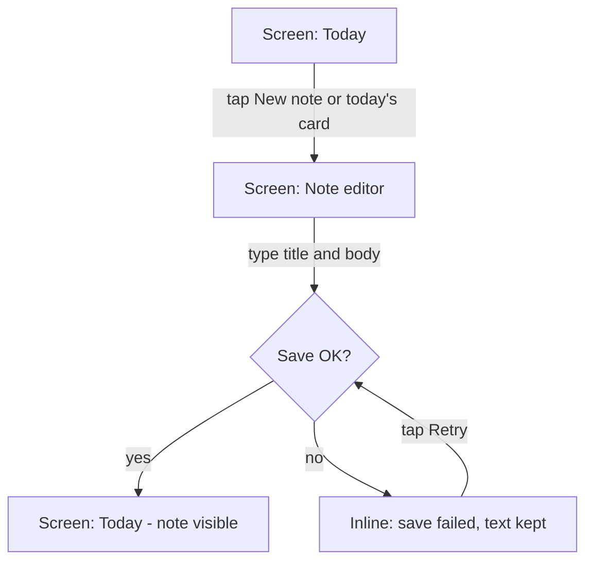
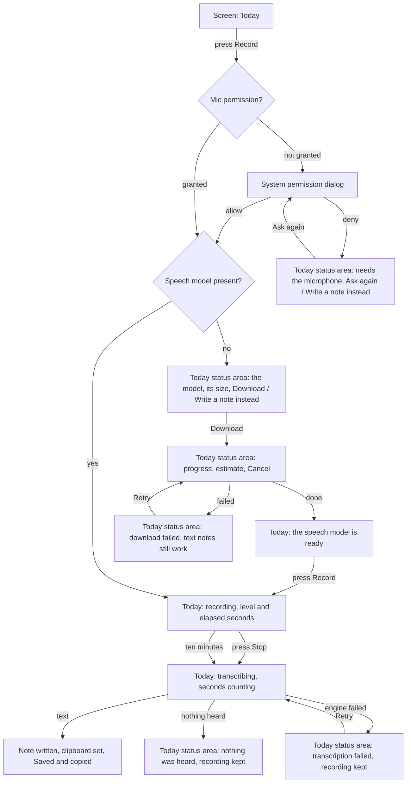
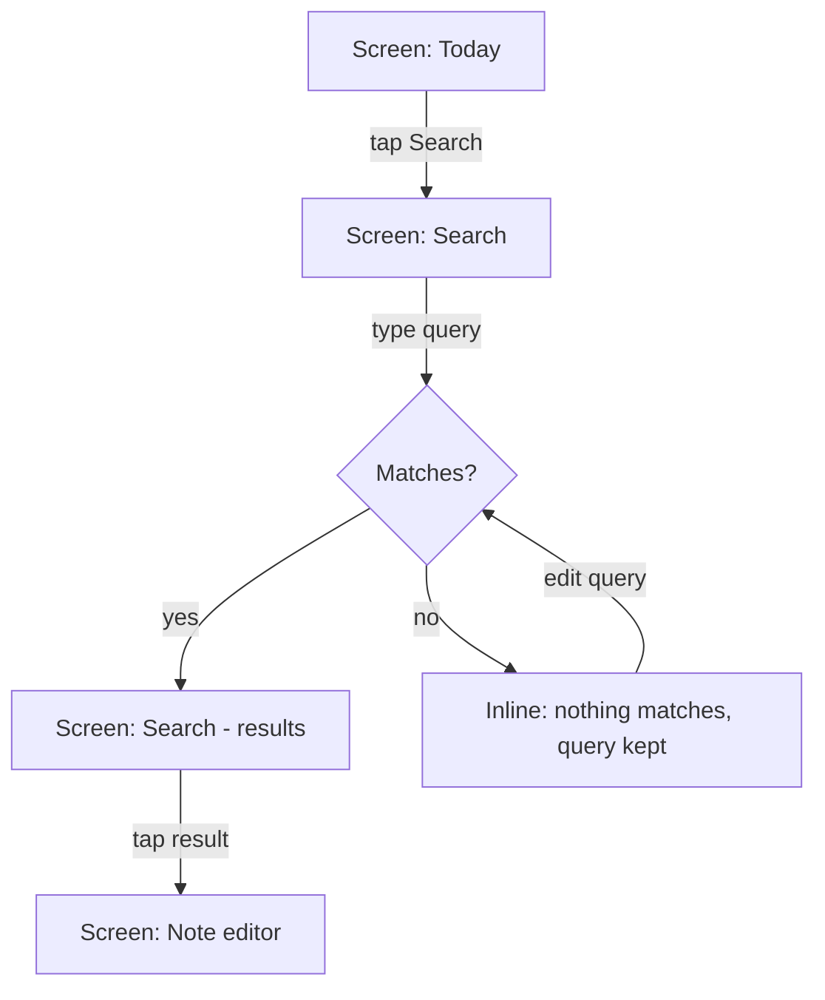
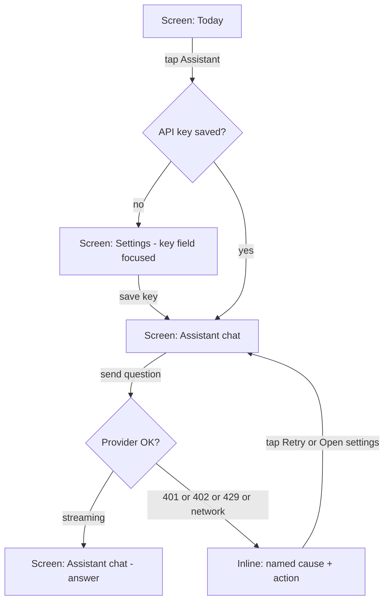
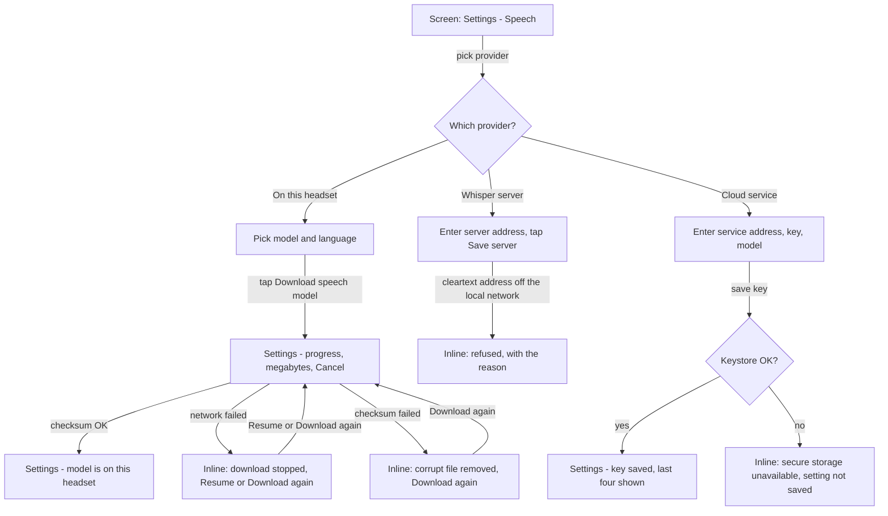
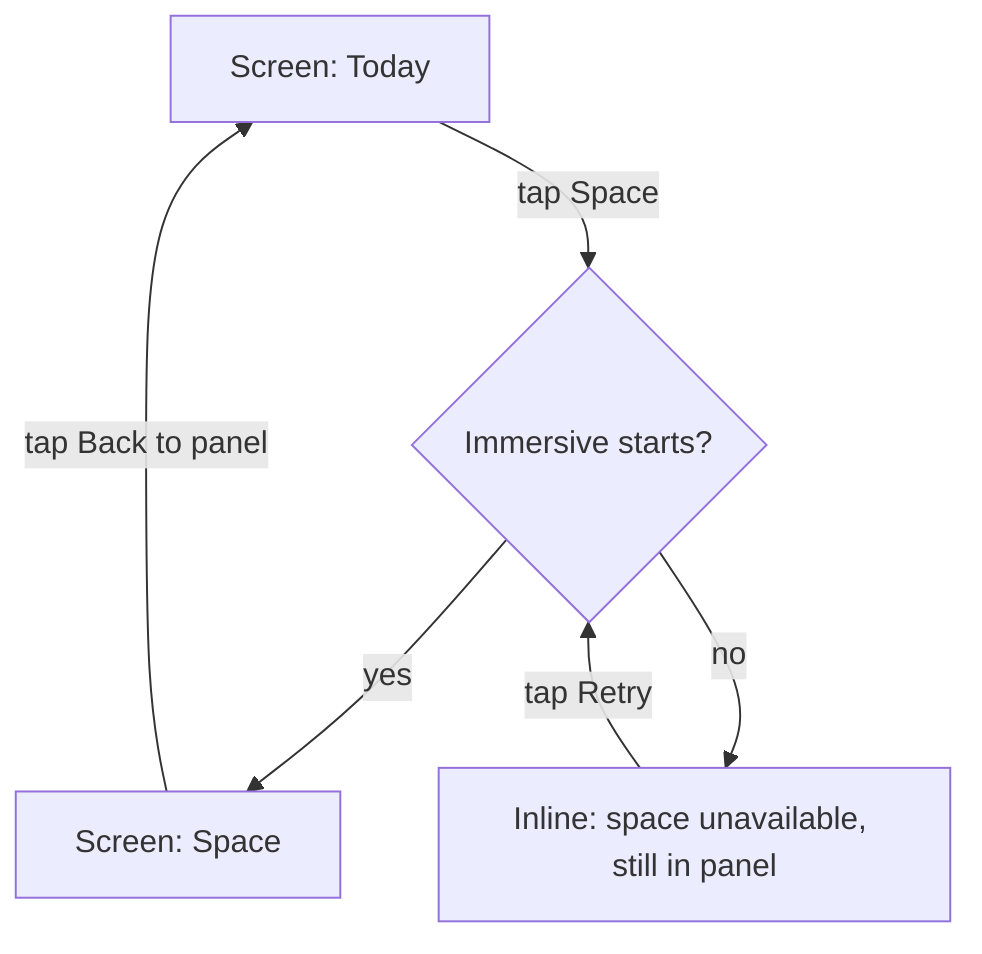

<!-- Managed with super-ux (ux-contract v4). The HOW layer: task analysis and user flows scenarios trace to. -->

# Flows — Fabric VR v1

> `DEC-0010` deleted the hold gesture and the capture sheet: recording is press-to-start,
> press-to-stop. **FLW-02 was rewritten against the shipped shape on 2026-09-21** (`T-042`); it
> had documented the hold as the design and the shipped behaviour as the *rejected* alternative,
> which is the most misleading state a contract document can be in — it does not merely describe
> the wrong product, it argues against the right one. The reversal's reasoning lives in
> `DEC-0010`, and this file cites it rather than restating it. `DEC-0051` records the sweep.

## Index

| ID | Flow | Traces | Screens |
|----|------|--------|---------|
| FLW-01 | Write a text note | ST-001, ST-005, ST-006 | SCR-01, SCR-02 |
| FLW-02 | Capture a voice note | ST-002, ST-003, ST-010 | SCR-01, SCR-02 |
| FLW-03 | Find a note | ST-004, ST-005 | SCR-01, SCR-04 |
| FLW-04 | ~~Ask the assistant~~ — **retired by `DEC-0020`** | ST-007, ST-010 | SCR-05 (retired) |
| FLW-05 | Set up speech | ST-003, ST-010 | SCR-06, SCR-07 |
| FLW-06 | Move to the space and back | ST-009 | SCR-01, SCR-08 |

### FLW-01: Write a text note
- **Traces:** ST-001 (JTBD-01, JRN-01/#4), ST-005, ST-006
- **Goal:** a typed thought is in the base and mirrored to the vault
- **Entry points:** app launch (today's note); *New note* on SCR-01; a note row in the list
- **Success exit:** the note is listed on SCR-01 and its Markdown file exists
- **Task analysis:**
  1. Land where writing is possible without navigating (today's note)
  2. Type a title and body, with `#tags` inline if wanted
  3. Leave the editor; the save is automatic and visible
- **Rejected shape:** a modal "new note" dialog over the list — lost because the first action after
  launch would cost two taps in a headset where every tap is a raycast, and because a dialog cannot
  hold an attached recording later.
- **Flow:**

- **Screens traversed:**

  | Screen | States used here |
  |--------|------------------|
  | SCR-01 Today | loading, empty, success, error |
  | SCR-02 Note editor | loading, success, error |

### FLW-02: Capture a voice note
- **Traces:** ST-002 (JTBD-01, JRN-01/#2), ST-003, ST-010
- **Goal:** spoken words become a note with a transcript and its audio
- **Entry points:** *Record* on SCR-01; *Record* on SCR-02, which appends to the open note
- **Success exit:** a note carrying the transcript, the detected language and the audio
- **Task analysis:**
  1. Press the record control; see that it is listening, with the elapsed seconds
  2. Speak; press it again
  3. Wait through transcription with a visible state and a counter
  4. Nothing — the transcript commits itself, and the confirmation says so
- **The shape that was rejected and then adopted, which is why this section was wrong for a
  month.** This flow documented hold-to-talk as the design and *tap-to-start / tap-to-stop* as
  the **rejected** alternative — with a reason that was sound when it was written: in a headset an
  accidental raycast leaves the microphone open with nothing on screen saying so, and a hold
  cannot be left running. `DEC-0010` reversed it, and the reversal's own reasoning is there rather
  than restated here: a hold asks a person to keep a controller ray steady on a target for the
  length of a thought, which is worse than the risk it avoids. The risk itself was answered
  separately — `DEC-0032` bounds a recording at ten minutes and **transcribes** rather than
  discarding it, `T-020` stops one when the screen goes away, and the elapsed count is on screen
  throughout. There is no *Save* and no *Discard* step: `DEC-0011` commits the transcript itself.
- **Flow:**

- **Screens traversed:**

  | Screen | States used here |
  |--------|------------------|
  | SCR-01 Today | success, error — **every state above is drawn in place on this one screen** |
  | SCR-02 Note editor | success — only when the dictation was started from the editor's own *Record* |

  **This row's index entry named SCR-03 and SCR-07 until `DEC-0057`**, four lines of table above
  a body that says the opposite — and `screens.md` justified keeping the retired SCR-03 on the
  grounds that *"FLW-02 still traces here"*, so a dead trace was being kept alive to support a
  justification that leaned on it. SCR-07 went with it: `DEC-0043` made it a **state of SCR-01**,
  drawn in place, not a screen a flow traverses.

  There is no capture sheet and no separate download screen: `DEC-0010` deleted the first and
  `DEC-0043` fixed the second as a state of SCR-01's status area. A flow that names a screen the
  product does not have sends a reader looking for it.

### FLW-03: Find a note
- **Traces:** ST-004 (JTBD-02, JRN-01/#5), ST-005
- **Goal:** the remembered note is on screen
- **Entry points:** *Search* on SCR-01; a tag chip on SCR-01
- **Success exit:** the note is open in the editor
- **Task analysis:**
  1. Open search with the field already focused
  2. Type remembered words; results narrow as you type
  3. Open the note
- **Rejected shape:** a separate tab for tags — lost because tags and text answer the same question
  ("where is it?") and two entry points double the decision in a headset.
- **Flow:**

- **Screens traversed:**

  | Screen | States used here |
  |--------|------------------|
  | SCR-01 Today | success |
  | SCR-04 Search | empty, loading, success, error |
  | SCR-02 Note editor | loading, success |

### FLW-04: Ask the assistant — RETIRED

**`DEC-0020` cut the assistant from v1** and commit `4f9cbf6` deleted the screen, its view model
and the route; `:feature-assistant` stays in the tree with its tests and nothing in the APK links
it. The flow below is kept as written rather than deleted, because the register's rule is that a
retired thing keeps its history — but **nothing in it is true of this build**, and the audit of
2026-09-21 (`B-192`) found it still reading as live, key paste and all.

- **Traces:** ST-007 (JTBD-03, JRN-01/#6), ST-010
- **Goal:** an answer grounded in the person's own notes
- **Entry points:** *Assistant* on SCR-01
- **Success exit:** the answer is on screen and the person acts on it
- **Task analysis:**
  1. Open the chat; if no key is saved, be sent to settings with one sentence explaining why
  2. Ask a question
  3. Watch the answer stream; stop it if it is going the wrong way
- **Rejected shape:** an assistant bar embedded in the note editor — lost because a question usually
  spans several notes, and an editor-scoped assistant would imply it only sees the open one.
- **Flow:**

- **Screens traversed:**

  | Screen | States used here |
  |--------|------------------|
  | SCR-01 Today | success |
  | SCR-05 Assistant chat | empty, loading, success, error |
  | SCR-06 Settings | success, error |

### FLW-05: Set up speech
- **Traces:** ST-003, ST-010 (JTBD-01, JRN-01/#3). It traced `ST-007` too while the assistant's key
  lived here; `DEC-0020` deleted that key field with the assistant, and this flow described pasting
  it until 2026-09-23.
- **Goal:** the person has decided where their voice goes, with which model and in which language,
  and whatever that choice needs is in place
- **Entry points:** *Settings* on SCR-01; *Download* on the model banner in FLW-02, which starts the
  same transfer Settings shows
- **Success exit:** the chosen provider is configured — a model on the headset, a whisper server
  address, or a cloud service address and key — and nothing about it is hidden
- **Task analysis:**
  1. Under *Where speech is transcribed*, pick *On this headset*, *Cloud service* or *Whisper
     server*; the line under the chips says what that choice does with the recording
  2. Under *Model on this headset*, pick one of five by name and size; choosing does not download,
     *Download speech model (N MB)* does
  3. Under *Language*, keep *Detect automatically* or pin one
  4. For *Cloud service*: the service address, key and model — the key goes to the Keystore and is
     shown afterwards only as its last four characters; for *Whisper server*: its address and *Save
     server*
- **Downloads are resumable** (`REQ-047`): a failed transfer keeps its usable bytes, and the button
  says *Resume* when they survived and *Download again* when they did not. Only a checksum mismatch
  removes the file (`DEC-0016`). There is no separate download screen: progress, *Cancel* and the
  failure are drawn in Settings and in SCR-01's status area, and both show the one process-wide
  transfer (`DEC-0033`).
- **Rejected shape:** bundling the speech model inside the APK — lost because it would add 190 MB to
  every install and make the first side-load slower than the first useful note.
- **Flow:**

- **Screens traversed:**

  | Screen | States used here |
  |--------|------------------|
  | SCR-06 Settings | success, error |
  | SCR-07 Model download — the download state's contract, drawn in place, not a screen | loading, success, error |

### FLW-06: Move to the space and back
- **Traces:** ST-009 (JTBD-01, JRN-01/#8)
- **Goal:** the same notes, in the room, and back again
- **Entry points:** *Space* on SCR-01
- **Success exit:** the person is back in the panel with nothing lost
- **Task analysis:**
  1. Press *Space*; the immersive activity starts and shows the same panel over passthrough
  2. Work there
  3. Press *Back to panel*; the shell reopens the 2D panel
- **Rejected shape:** shipping only the immersive activity — lost because it would take the whole
  headset and could not sit beside a streamed desktop, which is the product's premise.
- **Flow:**

- **Screens traversed:**

  | Screen | States used here |
  |--------|------------------|
  | SCR-01 Today | success, error |
  | SCR-08 Space | loading, success, error |
